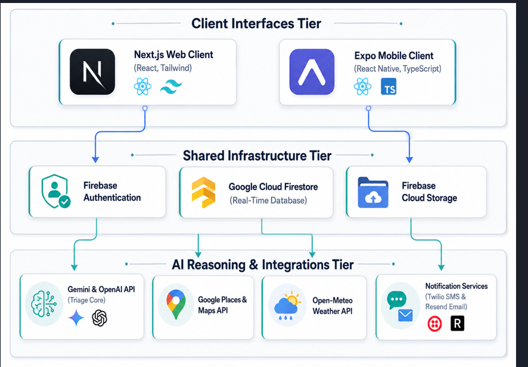
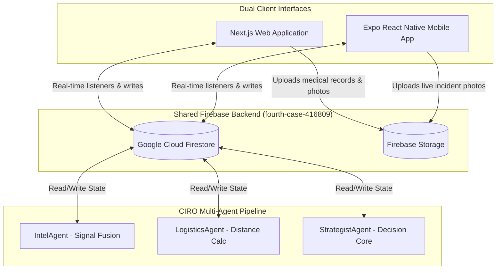
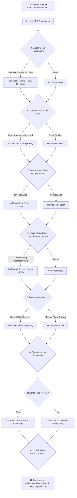

# MediLink Mobile — Clinical Triage & CIRO Command Center

Welcome to **MediLink Mobile**, the cross-platform native counterpart of the **MediLink Emergency Response Platform**. 

Developed using **React Native + Expo (SDK 55)** and **TypeScript**, this mobile app serves as a real-time portal connecting patients, doctors, and emergency dispatchers directly to the **CIRO (Crisis Intelligence & Response Orchestration)** network. By linking directly to the same Firestore backend as the Next.js web application, it ensures seamless synchronization and instant emergency management across all platforms.

---

## 📲 Quick Install (Android APK)

To install the preview build on your Android device:

1. **Direct Download:** [Click here to download the APK](https://expo.dev/accounts/syedasim17/projects/medilinkMobile/builds/b56c035e-b37b-4aa8-ae30-3fa2b49dc056)
2. **Scan QR Code:** Scan the QR code below using your mobile camera or a QR scanner:

   

3. **Installation Guide:** If you are unsure how to install APK files on Android, watch the step-by-step video tutorial on YouTube below:

   [](https://www.youtube.com/watch?v=rHdc6-pY7T0)

---

## 🏗️ System Architecture & Shared Backend



MediLink is designed around a **Single-Source-of-Truth (SSOT)** database architecture. Both the web application (Next.js) and the mobile application (React Native) share the same Firebase configuration, syncing state in real-time through Firestore listeners.



### 🗄️ Shared Firestore Collections & Schemas

The database structure consists of the following key collections:

#### 1. `cases` (Primary Incidents Document)
Stores details of every active and historical emergency.
```json
{
  "id": "firestore_doc_id",
  "patientPhone": "string (+92XXXXXXXXXX)",
  "patientName": "string (optional)",
  "language": "english | urdu | pashto",
  "issueText": "string (original symptom input)",
  "imageUrl": "string (Firebase Storage link, optional)",
  "latitude": "number (GPS)",
  "longitude": "number (GPS)",
  "accuracy": "number (GPS accuracy in meters)",
  "severity": "critical | high | medium | low",
  "aiSummary": "string (translated & summarized in clinical English)",
  "aiSuggestions": [
    "string (medical actions formatted for doctor review)"
  ],
  "situationalSuggestions": [
    "string (first aid / immediate safety steps for patient)"
  ],
  "emergencyRequired": "boolean",
  "status": "pending | assigned | dispatched | arrived | resolved | completed | closed",
  "address": "string (reverse-geocoded local address)",
  "assignedDoctorId": "string (optional)",
  "protocolApproved": "boolean (approved by doctor)",
  "createdAt": "number (timestamp)",
  "updatedAt": "number (timestamp)"
}
```

#### 2. `patient_profiles` (Patient Medical History)
Used to cross-reference pre-existing conditions, allergies, and medication history during triage.
```json
{
  "phone": "string (Document ID - e.g., +923331234567)",
  "name": "string",
  "email": "string",
  "bloodGroup": "string",
  "allergies": ["string (e.g. Penicillin)"],
  "chronicConditions": ["string (e.g. Asthma, Diabetes)"],
  "currentMedications": [
    {
      "id": "string",
      "name": "string",
      "dosage": "string",
      "frequency": "string",
      "startDate": "number",
      "endDate": "number (optional)",
      "prescribedBy": "string",
      "remainingDoses": "number",
      "totalDoses": "number"
    }
  ],
  "pastMedicalRecords": ["string (URLs to docs in Storage)"],
  "createdAt": "number",
  "updatedAt": "number"
}
```

#### 3. `cases/{caseId}/messages` (Real-Time Communication Sub-Collection)
Enables instantaneous chat between patients, doctors, and logistics responders.
```json
{
  "id": "string",
  "caseId": "string",
  "senderId": "string (e.g. patient-phone or doctor-id)",
  "senderRole": "patient | doctor | emergency",
  "senderName": "string",
  "message": "string",
  "timestamp": "number"
}
```

#### 4. `intelligence_logs` (CIRO Audit Trail)
Houses logs of multi-agent reasoning during triage.
```json
{
  "id": "string",
  "caseId": "string (optional)",
  "crisisId": "string (optional)",
  "agentName": "Orchestrator | TriageAgent | LogisticsAgent | IntelAgent | StrategistAgent",
  "thought": "string (agent reasoning process)",
  "action": "string (e.g. CLUSTER_DETECTED | WEATHER_ALERT | CRISIS_ESCALATED)",
  "confidence": "number (0.0 to 1.0)",
  "timestamp": "number"
}
```

#### 5. `scheduled_tasks` (Continuous Care Buffer)
Holds queued reminders like medication alarms that trigger automated alerts.
```json
{
  "id": "string",
  "type": "medication_reminder | emergency_followup",
  "targetPhone": "string",
  "targetEmail": "string",
  "data": {
    "name": "string",
    "dosage": "string",
    "frequency": "string"
  },
  "scheduledFor": "number (epoch timestamp)",
  "status": "pending | executed | cancelled | failed",
  "createdAt": "number"
}
```

---

## 🤖 CIRO Multi-Agent Signal Fusion Pipeline

When a patient reports an emergency, the **CIRO Signal Fusion Pipeline** is executed asynchronously in the background. It aggregates multiple evidence streams to determine whether the incident is isolated or part of a wider regional crisis.



### Signal Fusion Stages:
1. **Cluster Scan (`TriageAgent`)**: Queries cases in Firestore created within the last 30 minutes in a 1.5km radius. Confirmed cluster patterns add up to **+60%** confidence.
2. **Weather Scan (`TriageAgent`)**: Hits Open-Meteo REST API at GPS coordinates. Adverse weather conditions (e.g. torrential rain, dense fog, sandstorms) boost confidence by **+15%**.
3. **Map Context Check (`LogisticsAgent`)**: Queries Google Places API to search within 300m for critical facilities (schools, transport terminals). Identifying high-traffic zone risk adds **+10%**.
4. **Social Signals Corroboration (`IntelAgent`)**: Scans the `social_signals_demo` collection for active, geographically matching social posts/hashtags. Corroboration yields up to **+15%**.
5. **Autonomic Escalation (`StrategistAgent`)**: If the cumulative confidence score reaches **65% or more**, CIRO automatically registers a `crisis_event` (such as a *Urban Flood Emergency* or a *Multi-Casualty Incident*).
6. **Logistics Routing (`LogisticsAgent`)**: Immediately calculates the nearest hospital and ambulance service, sends details directly to the patient's chat, and locks route directions.

---

## 📱 Mobile Portal Interfaces & User Scenarios

### 1. Patient Portal (Reporting & Guidance)
* **Tech Stack**: React Native components, `expo-image-picker` (camera/gallery uploads), `expo-location` (GPS locks), Gemini API (fallback to GPT-4o and regex rule engine).
* **Multi-Lingual AI Input**: Patients can input text or images. Gemini translates inputs from Urdu, Roman Urdu, Pashto, or Roman Pashto into clinical English, identifies possible conditions, and computes immediate first-aid safety rules.
* **Live GPS Tracking**: Resolves the exact coordinates into a readable address using Nominatim reverse-geocoding, making coordinates instantly dispatchable.
* **Situational Guidance Panel**: Renders dynamic map tracking, pending reviewer details, and custom emergency instructions.

#### 🏃‍♂️ Patient Walkthrough Example:
1. **Login & Lock Location**: Patient enters their phone number (`+923331112222`). The app uses `expo-location` to lock coordinates at `34.0150, 71.5805` (Peshawar).
2. **Incident Report**: The patient types in Roman Urdu: *"Meri chhati me boht tez dard hai aur sans lene me masla ho raha hai"* (My chest is hurting badly and I am having trouble breathing) and attaches a photo of their medication bottle.
3. **Client-Side AI Processing**:
   - The app reads the primary key from `ENV` and queries Gemini.
   - Gemini translates the Roman Urdu to English, categorizes severity as **Critical**, and identifies the symptoms as suspected **Myocardial Infarction (Heart Attack)**.
   - It drafts patient advice: *"Sit upright. Loosen tight clothing. Chew a full aspirin if available. Do not engage in physical exertion."*
4. **Firestore Record Creation**: The app uploads the photo to Firebase Storage and saves the formatted incident document to `cases/` in Firestore.
5. **Active Tracking Page**: The patient is routed to the active tracking panel. They see their live coordinates and a message indicating the case is queued for physician review.

---

### 2. Doctor Hub (Review & Clinical Approvals)
* **Tech Stack**: Swipe lists, React Native modal popups, Firebase Real-Time Listeners.
* **Diagnostics Interface**: Displays patient symptoms, AI summaries, suspected conditions, pre-existing allergies, and attached images.
* **Safety & Contraindication Alerts**: Warns the doctor if the AI-suggested protocol includes substances the patient is allergic to (by cross-referencing `patient_profiles`).
* **One-Click Approval**: Clicking "Approve Protocol" updates the case status, alerts the patient, and registers medication scheduling timers.

#### 🩺 Doctor Walkthrough Example:
1. **Live Incident Feed**: Dr. Farooq opens the Doctor Hub on his mobile app. He sees a new **Critical** incident card highlighting a heart attack suspect.
2. **Detailed Examination**:
   - Dr. Farooq opens the patient card.
   - The UI shows the symptom: *"Myocardial Infarction"* and lists the patient's chronic conditions (Diabetes) and allergies (None).
   - The AI suggestions list: *"Aspirin 300mg — chew immediately"* and *"Glyceryl Trinitrate (GTN) 0.5mg sublingual"*.
3. **Clinical Action**:
   - Dr. Farooq clicks **Approve Protocol**.
   - Firestore immediately triggers an update: `cases/{caseId}/protocolApproved = true` and registers the prescribed medicines.
   - The patient's portal automatically updates in real-time, showing the approved treatment advice.
   - The system initiates `scheduleMedicineReminders` which parses the dosage details and logs a scheduled task inside `scheduled_tasks` to check up on the patient.

---

### 3. Emergency Dispatcher (Ambulance & Logistics)
* **Tech Stack**: `react-native-maps`, real-time chat, CIRO terminal logs.
* **Interactive Map**: Shows active incident markers.
* **CIRO Log Stream**: Renders a black terminal console displaying live logs from `intelligence_logs` so dispatchers can watch the multi-agent reasoning in real-time.
* **Ambulance Tracking**: Lets dispatchers update status (`assigned` -> `dispatched` -> `arrived` -> `completed`), updating maps across both dispatcher and patient apps.

#### 🚑 Dispatcher Walkthrough Example:
1. **Emergency Intake**: Dispatcher Sarah monitors the Emergency Dispatch console. A critical card for a heart attack pops up at coordinates `34.0150, 71.5805`.
2. **Viewing AI Reasoning**:
   - Sarah opens the case. The terminal shows:
     `[TriageAgent]: Querying cases. 0 nearby reports. Isolated incident.`
     `[TriageAgent]: Weather clear (22°C).`
     `[LogisticsAgent]: High-risk zone inferred: Main road area.`
     `[LogisticsAgent]: Nearest ambulance: Edhi Cantt (0.8km, 3 mins). Hospital: Hayatabad Medical Complex.`
3. **Dispatch Execution**:
   - Sarah clicks **Assign Unit**. The map renders the route.
   - Sarah clicks **Dispatch**. The Edhi Cantt ambulance team receives the dispatch alert. The case status updates to `dispatched` in Firestore.
   - The patient's chat automatically receives an alert from the **CIRO Logistics Agent**:
     *"Ambulance Dispatched. Nearest Hospital: Hayatabad Medical Complex. ETA: 3 mins. Help is on the way."*
   - Sarah stays in touch with the patient using the built-in real-time chat panel until the ambulance marks its arrival (`Mark Arrived on Scene`).

---

## 🛠️ Installation & Setup

1. **Clone & Enter Directory**:
   ```bash
   cd medilinkMobile
   ```
2. **Install Dependencies**:
   ```bash
   npm install
   ```
3. **Set Up Local Env File**:
   Create a `.env` file in the root directory:
   ```env
   EXPO_PUBLIC_GEMINI_API_KEY=your_gemini_key
   EXPO_PUBLIC_GEMINI_API_KEY_FALLBACK=your_fallback_gemini_key
   EXPO_PUBLIC_OPENAI_API_KEY=your_openai_key
   EXPO_PUBLIC_GOOGLE_MAPS_API_KEY=your_google_maps_key
   EXPO_PUBLIC_RESEND_API_KEY=your_resend_email_key
   ```
4. **Start Metro Bundler**:
   ```bash
   npx expo start
   ```
5. **Run App**:
   - Press `a` for Android Emulator.
   - Scan the QR code using the **Expo Go** app on your physical iOS or Android phone.

---

## 📦 Compiling Standalone Android APK

To build the standalone `.apk` executable for testing:

1. **Install EAS CLI globally**:
   ```bash
   npm install -g eas-cli
   ```
2. **Configure EAS Project**:
   ```bash
   eas build:configure
   ```
3. **Execute Standalone Android Build**:
   ```bash
   eas build --platform android --profile preview
   ```
   *This command compiles the application in the Expo cloud and yields a direct download link to the final `.apk` file.*

---

## 🛠️ Tech Stack & Technologies Used

- **Frontend (Web App)**: Next.js 14 (App Router), Tailwind CSS, TypeScript, Framer Motion, Radix UI.
- **Mobile App**: React Native, Expo SDK 55, Expo Router (File-based Navigation), Tailwind CSS, TypeScript.
- **Backend & Real-Time Sync**: Google Cloud Firestore (Live Snapshot Listeners), Firebase Storage (Incident asset uploads).
- **AI Symptom Triage**: Gemini 2.5 Flash, Gemini 2.0 Flash, and OpenAI GPT-4o with automated multi-key rotation and rule-engine fallback logic.
- **Geographic Information Systems (GIS)**: `react-native-maps`, `expo-location` (GPS precision locking), Nominatim OpenStreetMap API (Reverse-geocoding coordinates to street addresses).
- **Communication & Continuous Care**: Twilio (SMS/voice alerts), Resend (Transactional emails), CIRO Temporal Task Scheduler (for medication and check-up reminders).
- **Context API Integrations**: Open-Meteo API (Adverse weather risk scoring), Google Places API (High-traffic zone mapping).

