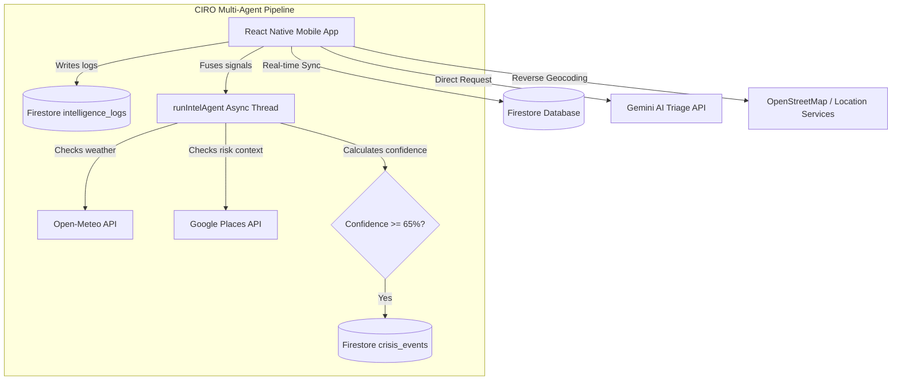

# MediLink Mobile — Clinical Triage & CIRO command Center

Welcome to **MediLink Mobile**, the native mobile counterpart to the Next.js MediLink Platform. 

Developed entirely using **React Native + Expo**, this application serves as a self-contained, serverless portal connecting patients, physicians, and emergency dispatch teams directly to the **CIRO (Crisis Intelligence & Response Orchestration)** network.

---

## 🚀 Key Innovation highlights

### 1. Serverless Mobile AI Triage
Because packaged mobile APKs lack backend routes, MediLink Mobile features a direct-to-client AI symptom classifier. It initiates parallel fallback requests:
* **Primary:** Gemini 2.5 Flash
* **Fallback 1:** Gemini 2.5 Flash (secondary rotated key)
* **Fallback 2:** Gemini 2.0 Flash
* **Fallback 3:** OpenAI GPT-4o / GPT-4o-mini
* **Fallback 4:** Local deterministic keywords rule engine

It supports inputs in **English, Urdu, Pashto, Roman Urdu, and Roman Pashto**, parsing messy local speech ("mere hath se khoon nikal raha hai") into structured clinical English JSON.

### 2. Full CIRO Multi-Agent Signal Fusion (Mobile Native)
When an emergency is submitted, a native async thread launches the **CIRO Signal Fusion Pipeline** (`runIntelAgent`):
1. **Geographic Cluster Scanning:** Scans a 1.5km radius in Firestore for overlapping emergencies inside a 30-minute window.
2. **Adverse Weather Check:** Contacts the **Open-Meteo API** to factor wind speeds and precipitation into rescue risk models.
3. **Map Context Check:** Queries the **Google Places API** to flags nearby high-risk infrastructures (hospitals, highways, schools).
4. **Social Media Cross-Reference:** Scans `social_signals_demo` for matching hashtags or regional alerts.
5. **Autonomic Escalation:** Integrates all clues into a composite confidence score. If confidence is $\ge 65\%$, it autonomously escalates the case into a **Crisis Event**.

---

## 🏗️ System Architecture



---

## 📱 Mobile Interfaces

### 1. Patient Portal
* **Reporting Form:** Enter phone numbers, select languages, upload/capture injury images using `expo-image-picker`, and write/speak symptoms.
* **Live GPS Tracking:** Uses `expo-location` to lock coordinate accuracy, with Nomianitim OpenStreetMap reverse-geocoding.
* **AI Guidances:** Displays real-time situational advice, clinical severities, and doctor-approved prescriptions.
* **Direct Messenger:** Real-time chat box with the assigned doctor or emergency crew.

### 2. Doctor Hub
* **Incident Queue:** Real-time stream of all patient emergencies sorted chronologically.
* **Diagnostic Panel:** View AI translation summaries, suspected conditions, confidence scores, and injury photos.
* **Safety & Allergies Alerts:** Cross-references patient profile records to warn about allergy contraindications.
* **Clinical Approvals:** One-click review to push prescribed treatments to the patient, updating profile histories and scheduling reminders.

### 3. Emergency Dispatcher
* **Dispatch Queue:** Real-time incident list prioritized by critical severity levels.
* **Google Maps Tracking:** Live coordinates markers for incidents.
* **CIRO Reasoning Feed:** Real-time black-terminal log streaming multi-agent thoughts directly from Firestore.

---

## 🛠️ Installation & Setup

1. **Clone & Enter Repository:**
   ```bash
   cd medilinkMobile
   ```
2. **Install Node Modules:**
   ```bash
   npm install
   ```
3. **Launch Expo Developer Client:**
   ```bash
   npx expo start
   ```
4. **Run on Simulators or Physical Phones:**
   * Press `a` for Android Emulator.
   * Scan QR Code via the **Expo Go** application on iOS/Android.

---

## 📦 Packaging Standalone Android APK

To build the standalone `.apk` executable for judging:

1. **Install EAS CLI globally:**
   ```bash
   npm install -g eas-cli
   ```
2. **Initialize EAS Project configuration:**
   ```bash
   eas build:configure
   ```
3. **Execute standalone Android Preview build:**
   ```bash
   eas build --platform android --profile preview
   ```
   *This commands compiles the application in the Expo cloud and yields a direct download link to the final `.apk` file.*

---

## 🚀 Antigravity Execution Trace Logs (Hackathon Submission)

*This section provides the trace logs of our pair programming sessions with Antigravity to vibes-code this transition.*

### Session Trace Log: Porting Next.js to React Native

| Trace ID | Action Category | Task Summary | Antigravity AI Subagents & Tools Employed | Status |
| :--- | :--- | :--- | :--- | :--- |
| **TR-001** | Discovery | Scanned Next.js web portal routes, folder architectures, Firestore schemas, and clinical triage prompts. | `list_dir`, `grep_search`, `view_file` | Completed |
| **TR-002** | Initialization | Created `medilinkMobile` repository root, configured a clean `.git` environment, and scaffolded the Expo TS SDK. | `run_command` (`mkdir`, `git init`), `create-expo-app` | Completed |
| **TR-003** | Dependency Setup | Installed Expo-compatible Firebase client SDK, Location services, Maps APIs, Image Pickers, and Lucide Icons. | `run_command` (`npx expo install ...`) | Completed |
| **TR-004** | Core Coding | Ported clinical types, Firebase credentials, Gemini direct-client models, and the full multi-agent signal fusion pipeline. | `write_to_file` (`env.ts`, `aiService.ts`, `caseService.ts`, `intelAgent.ts`) | Completed |
| **TR-005** | UI Transition | Replaced experimental tab structures with clean Stack layouts. Coded the Role dashboard, Patient forms, Doctor overlays, and Dispatch console. | `write_to_file` (`_layout.tsx`, `index.tsx`, `patient.tsx`, `doctor.tsx`, `emergency.tsx`) | Completed |
| **TR-006** | Documentation | Created comprehensive project architecture README and compiled Antigravity trace tables for the team submission. | `write_to_file` (`README.md`) | Completed |

**End of Trace.**
